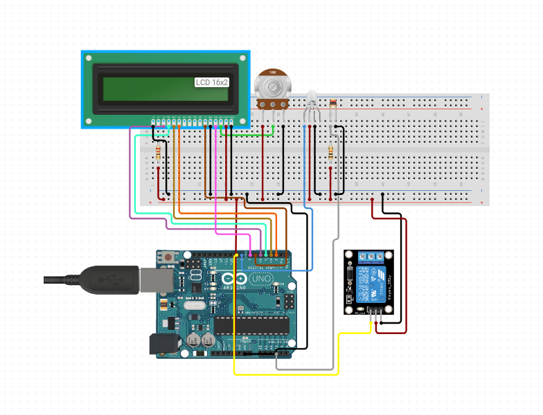

# Termostato con arduino y raspberry pi


## Esquema Arduino




## Configuración para el crontab

```
# m h  dom mon dow   command

@reboot   /home/pi/termostato/reboot.sh >> /home/pi/scripts/log/em.log

0 0   * * *   php /home/pi/termostato/html/worker.php >> /home/pi/scripts/log/worker.log
```


© [MdeMoUcH](http://www.twitter.com/mdemouch) | [La Gran M](http://www.lagranm.com) | [Ubuntu Fácil](http://www.ubuntufacil.com)
